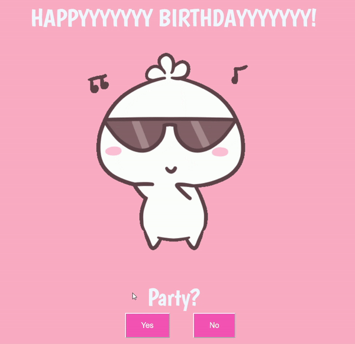

# Tired of boring text messages and generic cards?  
## This project is gonna make you the most extra friend ever!

# Birthday_Bash
Wish your friends & family in a unique way on their birthday!

<!--  -->
 

## If they say Yes!

## If they say No!
 

## How to use this Repo?

### 1)Clone this repo: Tap that green button, like you're double-tapping your crush's latest selfie.
### 2)Open the home.html file: It's like opening the door to a party full of awesome vibes.
### 3)Customize the GIF: Swap out the existing GIF with one that's your friend's vibe. Maybe a dancing Charmander? A sassy cat? The possibilities are endless, like the snacks at a good party.
### 4)Save the file: Just like saving the best Reels for later.
### 5)Send the link: Slide into their DMs with the link to the file, or drop it casually in a group chat.

## FAQ

### Q: Can I use this for other celebrations?
### A: Heck yeah! Anniversaries, graduations, or even small celebrations any excuse for a party!

### Q: Can I add my own music?
### A: Sadly, no. But you can always play your bday beats in the background while they open it.

### Q: Can I make it even more extra?
### A: Always! Add confetti, glitter, or even a virtual cake-throwing feature. The sky's the limit, fam!

